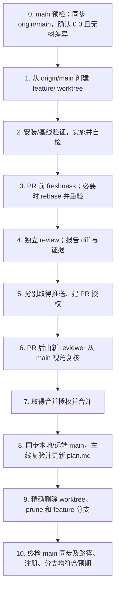

# JSSH RAG 协作说明

本文件定义 JSSH RAG 仓库的目录边界、证据治理、协作流程和验证入口。运行方法见
[README.md](README.md)，当前范围和工作记录见 [plan.md](plan.md)。协议、引脚、硬件状态和真机结论
始终以只读源仓库中的目标版本资料为准，不在本仓库重复维护第二份事实。

## 核心边界

1. 第一阶段只支持 `1.6_R6`，不得自动回退到 `1.6`、`1.65`、`1.2`、`2.0` 或 `ARCHIVE`。
2. 源仓库固定由来源策略显式配置；当前入口是 `C:\work1\JSZN\ESP32_S3` 的 `1.6_R6/`。
3. 对源仓库只允许 Git 和文件读取，不得从 RAG 流程修改、提交、切换分支、构建、烧录或控制设备。
4. 只索引 Git 跟踪且与声明提交一致的正式文本；目标版本存在已跟踪未提交修改时拒绝索引。
5. `.WORKTREE`、`ARCHIVE`、`tmp`、`output`、`.BUILD`、`release/out`、
   `validation/results`、未跟踪文件和不受支持的二进制格式不得进入文本 MVP 索引。
6. 本地数据库、模型、缓存和日志不得提交，也不得写入 ESP32_S3 仓库。
7. 默认完全离线；只有用户批准并显式配置私有服务地址时，才可向 Embedding 或 LLM 服务发送文本。
8. 第一阶段不访问串口、不烧录、不 OTA、不修改配置、不执行实时采集、不控制真实设备。

## 目录边界

| 路径 | 责任 | 说明入口 |
| --- | --- | --- |
| `config/sources/` | 版本、源仓库、扩展名和排除目录策略 | `v1_6_r6.json` |
| `config/metadata_overrides/` | 精确路径的受控状态与证据覆盖 | `v1_6_r6.json` |
| `src/jssh_rag/models.py` | 版本、文档、chunk、引用和回答数据模型 | 源码 docstring |
| `src/jssh_rag/indexer.py` | Git 跟踪文件发现、提交身份校验和确定性切分 | 源码 docstring |
| `src/jssh_rag/store.py` | SQLite 文档、chunk、FTS5 和向量缓存 | 源码 docstring |
| `src/jssh_rag/retriever.py` | 版本过滤、标识符/全文/语义混合检索 | 源码 docstring |
| `src/jssh_rag/answering.py` | 拒答、证据边界、冲突呈现和引用生成 | 源码 docstring |
| `src/jssh_rag/evaluator.py` | 黄金问题和 MVP 指标计算 | `evals/v1_6_r6.jsonl` |
| `src/jssh_rag/cli.py` | `index`、`search`、`ask`、`evaluate` 入口 | [README.md](README.md) |
| `tests/` | 单元、边界和端到端 CLI 测试 | `python -m unittest discover -s tests -v` |
| `data/` | 本地索引和缓存 | Git 忽略，不是源码或交付物 |
| `plan.md` | 跨工作区范围、门禁和简要工作记录 | [plan.md](plan.md) |

新增独立职责时才新增模块或目录；不要为尚未启用的版本、向量数据库、Web UI、Agent 或设备工具预建框架。

## 版本、状态与证据治理

1. 每个正式文档必须携带产品、硬件版本、仓库相对路径、Git commit、源文件 SHA-256、文档类型、
   模块、状态和证据等级；缺少版本、commit 或哈希时拒绝索引。
2. 状态只允许 `current`、`draft`、`superseded`、`archive`。
3. 证据等级只允许代码定义的受控枚举；无可靠证据时使用保守的 `source_reviewed`。
4. `docs/superpowers/plans/` 默认是 `draft + design_proposed`，不得进入“已验证”列表。
5. `design_proposed`、`source_reviewed`、仿真、Host、QEMU、构建、烧录、真机部分验证、真机通过和
   量产接受必须分开；低等级证据不得提升为高等级结论。
6. `current` 与非 current 来源同时命中时必须显示冲突并保留双方引用，不自行选择方便的结论。
7. 所有关键结论必须引用目标版本原文件、标题或符号、起止行、commit 和 SHA-256；无目标版本证据时明确拒答。
8. 元数据修正优先使用受控覆盖文件，不批量修改源仓库文档。

## 文档与代码规则

1. 修改前先阅读本文件、[README.md](README.md)、[plan.md](plan.md) 和受影响模块源码/测试。
2. README 只维护项目入口、边界和稳定命令；工作状态、提交和评估快照写入 `plan.md`。
3. 行为、接口、配置项、命令或证据规则变化时，同一提交更新对应测试和所属文档。
4. 新增 Python 模块时在文件开头说明职责；公开类和函数使用中文 docstring，并按需写 `Args:`、
   `Returns:`、`Raises:`。
5. 不复制源仓库中易变的引脚、端口、协议字段或真机结论；回答通过引用返回这些事实。
6. Git 提交 subject 优先使用准确、可检索的中文；命令、路径、协议名和代码标识符按原文保留。
   不要提交生成数据库、缓存、日志或个人环境配置。

## 需求对齐与工作记录

1. 影响硬件版本、源仓库、纳入/排除范围、证据等级、数据外发、删除、推送、PR 或设备权限时，
   必须使用明确目标，不得根据历史映射猜测。
2. 每项已完成工作在 [plan.md](plan.md) 增加一行，记录日期、方式、工作区/分支、范围、验证、
   提交或 PR 和状态；详细差异仍以 Git 为准。
3. PR 未合并写“待合并”或“进行中”；合并并在 `main` 复验后才写“已完成”。
4. 索引成功只证明语料处理完成，不代表源固件构建、烧录或真机验收完成。

## 提交粒度

1. 将工作拆为可独立验证的原子步骤；源码、相关测试、README 和必要记录放在同一提交。
2. 不使用 `git add .` 或 `git add -A`；显式暂存本次文件，保留用户的无关改动。
3. 每个提交前运行受影响测试和 `git diff --check`，不得把失败或未解释的错误带入下一步。

## Worktree 与 PR 流程

代码和重要规则变更必须走本流程；纯阅读、状态报告和不改变规则的小型文字修订可在干净的
`main` 直接完成。`main` 是持久基线，临时 worktree 只用于隔离开发，代码 worktree 一律通过
PR 合入，不允许本地 `checkout main && merge`。



1. **主工作区预检与同步。**先用 `git worktree list --porcelain` 定位持有 `main` 的主工作区，并在那里执行
   `git status --short --branch`、`git remote -v` 和 `git fetch origin main --prune`，确认目标仓库与精确远程。
   创建 worktree 前，主工作区必须干净且本地 `main` 只能用 `git merge --ff-only origin/main` 同步；随后
   `git rev-list --left-right --count main...origin/main` 必须为 `0 0`，且
   `git diff --exit-code main..origin/main` 必须退出码为 0。主工作区有改动、主线分叉、无法 fast-forward
   或两项同步检查不通过时停止并报告，不得先创建 worktree 或用 rebase/强推改写 `main`。记录并保护已有
   脏改动、未跟踪文件、其他 worktree 和运行中进程；不清理、不暂存、不移动不属于本任务的内容。
   已在 linked worktree 中时不得嵌套创建。
2. **创建或恢复 worktree。**新任务从刚获取的 `origin/main` 创建
   `.WORKTREE/<purpose>/` 和 `feature/<task>`，创建前用
   `git check-ignore .WORKTREE/<purpose>` 确认目标路径受忽略，并确认精确路径和分支均未占用。
   恢复尚未发布的既有 feature worktree 时，须先确认工作区干净，
   再执行 `git fetch origin main --prune` 和 `git rebase origin/main`；存在未提交内容、冲突或基线不明时
   停止并报告，不使用自动 stash 掩盖状态。新建 worktree 已直接基于最新 `origin/main` 时无需再做一次空 rebase。
3. **环境与基线。**在新 worktree 按 README 完成本地安装或环境准备，并在修改前运行受影响的基线测试。
   基线失败必须先区分环境问题与既有代码问题并如实报告；未解释前不得归因于本次改动，也不得继续扩大改动。
4. **实施与自检。**按测试先行完成源码行为，将同一行为涉及的源码、测试、README 和必要工作记录放在
   同一原子步骤；只显式暂存本次文件。每个新提交的 subject 优先使用中文，英文命令、路径和代码标识符
   按原文保留。纯文档调整至少检查 Markdown 相对链接、命令入口、完整测试和 `git diff --check`。
   本地数据库、模型、缓存、日志和索引输出不得进入提交。
5. **PR 前 freshness。**交付前再次执行 `git fetch origin main --prune`，用
   `git rev-list --left-right --count origin/main...HEAD` 检查落后/领先提交数。尚未发布的分支如落后，
   执行 `git rebase origin/main`，然后重新运行全部受影响验证并重新检查完整 diff；
   发生冲突、无法重放或验证失败时停止并报告。rebase 冲突修复、review 修复和后续功能调整属于不同原子
   步骤时分别提交，不把未解释失败带入下一步。
6. **独立 review 与授权。**环境支持独立 reviewer 时，PR 前必须让 reviewer 只审完整 diff、项目规则和
   验证证据，不直接修改工作区；问题修复后重新执行 freshness、受影响验证和 review，最多三轮，第三轮仍
   未通过则停止并报告。不支持独立 reviewer 时明确记录限制，不得伪称已评审。review 通过后报告范围、
   diff、验证和目标远程；推送、创建 PR、合并前分别取得用户授权，并在每一步重新核对精确远程与目标分支。
7. **PR 后复核。**PR 创建后保留原 worktree，并从 `main` 主工作区启动一名新的独立 reviewer，检查 PR
   完整 diff、项目规则、CI、冲突、freshness 和验证证据；未通过时回原 worktree 修复，并从 PR 前 freshness
   重新走起，PR 前后合计最多三轮修复复核。分支一旦已推送或已创建 PR，不得用 rebase 改写已发布历史；
   需要吸收推进后的 `origin/main` 时，在 feature 分支创建可追溯的合并提交并重验，或停止请求用户选择。
   禁止强推覆盖远程历史。
8. **合并后主线同步与复验。**只有取得合并授权且 PR、CI、review、freshness 均通过后才可合并。随后先
   确认 PR 的实际 merge commit 已进入 `origin/main`，再回到干净的 `main` 主工作区执行
   `git fetch origin main --prune` 和 `git merge --ff-only origin/main`。同步后必须再次确认
   `git rev-list --left-right --count main...origin/main` 为 `0 0`，且
   `git diff --exit-code main..origin/main` 退出码为 0，才可在本地 `main` 运行受影响验证。若主工作区有
   用户改动、主线分叉、不能安全 fast-forward 或仍存在提交/树差异，不得覆盖、切换、rebase 或改写历史；
   必须停止并报告，临时验证 worktree 不能替代本地与远端 `main` 已同步这一最终门禁。
9. **工作记录与清理门禁。**主线复验通过后更新 [plan.md](plan.md) 中该工作的范围、验证摘要、提交/PR、
   merge 短提交号和“已完成”状态；由此产生的提交或推送仍遵守对应授权。清理前再次确认：PR 确已合并、
   精确目标 worktree 无未提交/未跟踪内容、忽略目录中没有需要保留的数据库或证据、没有进程占用该路径，
   本地与远端 `main` 已通过 `0 0` 和无树差异检查，且本地/远端待删分支名称与该 PR 完全一致。
   任一条件不满足时停止并确认。
10. **精确清理与终检。**从主工作区依次执行 `git worktree remove <exact-path>`、
    `git worktree prune`、`git branch -d feature/<task>`，并在已授权的精确远程上执行
    `git push origin --delete feature/<task>` 删除同名远端分支。
    Windows 出现目录锁时先释放引用该精确路径的编辑器、终端或进程，再重试；不得用 `--force`、递归广泛
    删除或模糊匹配绕过门禁。最后确认目标路径不存在、`git worktree list --porcelain` 无该注册、
    `git branch --list feature/<task>` 无本地分支、远端无同名 ref，`main...origin/main` 仍为 `0 0` 且无树
    差异，并复查无关脏改动和文件仍原样保留。满足这些条件后直接完成既定清理，不再把“是否保留临时
    worktree”作为额外选项。

## 验证入口

| 变更范围 | 最少验证 |
| --- | --- |
| 来源策略、元数据 | `tests.test_source_policy`、`tests.test_metadata`，并确认源版本没有已跟踪修改 |
| 解析、存储、重建 | `tests.test_indexer`、`tests.test_store`，实际执行一次 `index` |
| 检索、Embedding | `tests.test_retriever` 和完整黄金评估；关键版本污染必须为 0 |
| 回答、证据边界 | `tests.test_answering` 和完整黄金评估；引用、拒答、冲突与证据等级均须检查 |
| CLI | `tests.test_cli`，并对 `index/search/ask/evaluate` 做受影响命令冒烟测试 |
| 文档 | Markdown 相对链接检查、命令入口检查、完整测试和 `git diff --check` |

完整回归：

```powershell
python -m unittest discover -s tests -v
python -m compileall -q src tests
jssh-rag evaluate --version 1.6_R6
git diff --check
```

索引使用 SQLite 单写者；等待当前 `index` 完整退出后再启动下一次，不并发重建同一数据库。
